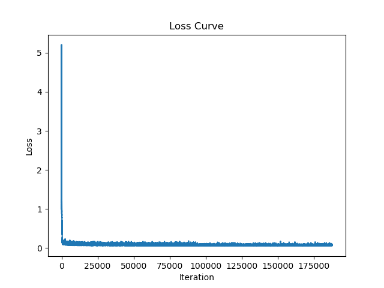
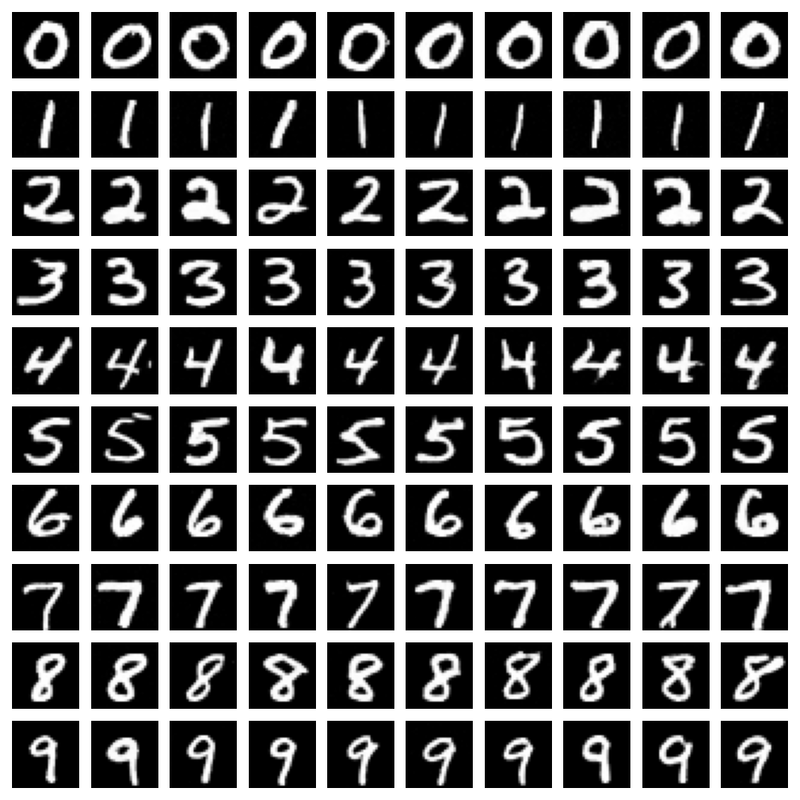
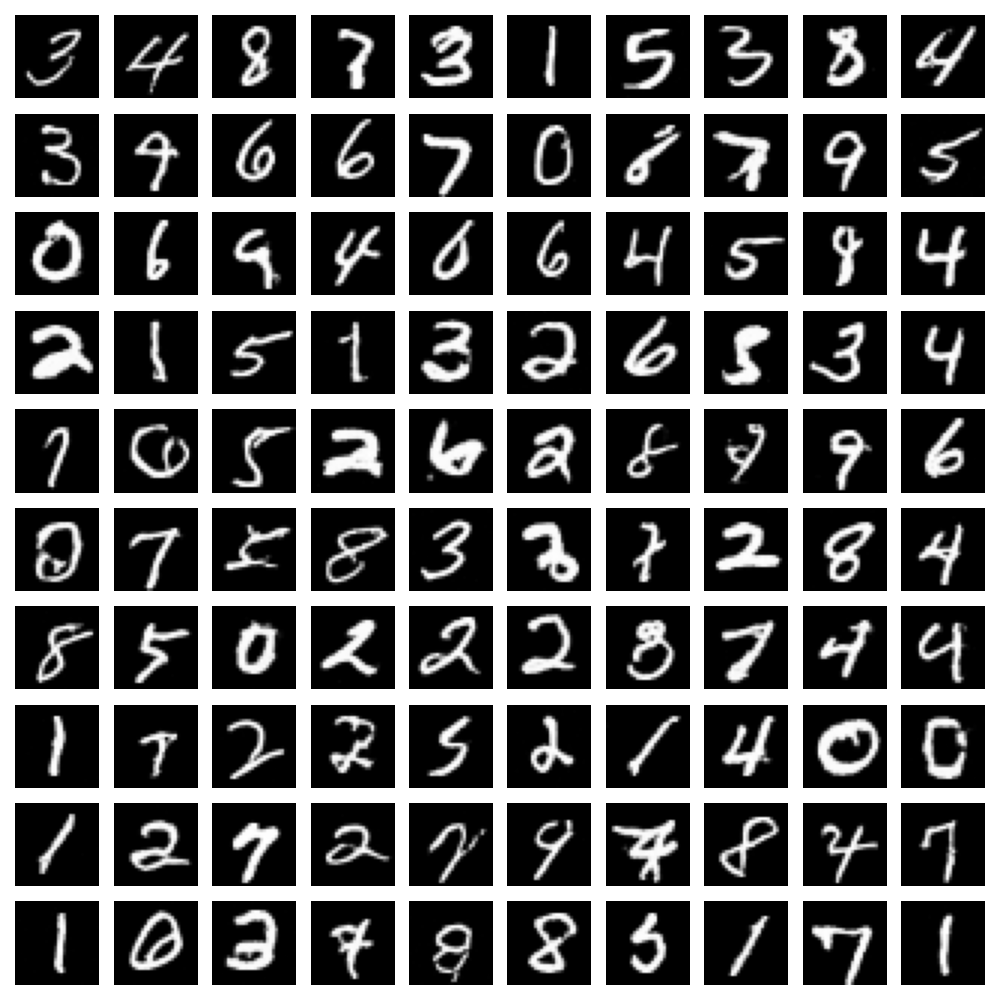

# Flow Matching (Rectified Flow) 处理 Mnist 数据集

使用 Unet 作为核心实现 Mnist 数据集的随机或条件生成。

## 结果说明

* v1.1版本同时支持无条件生成和条件生成，共训练50个epoch。

* 模型收敛较好

### epoch 50, step 10, conditional

### epoch 50, step 10, unconditional

